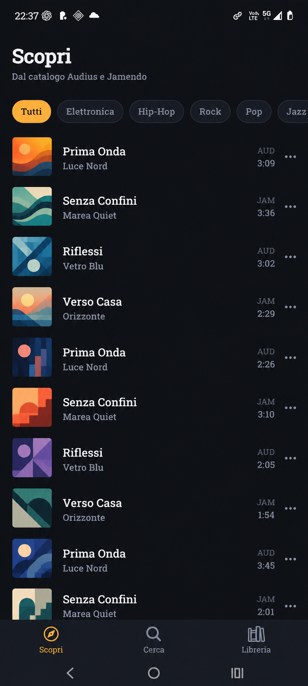
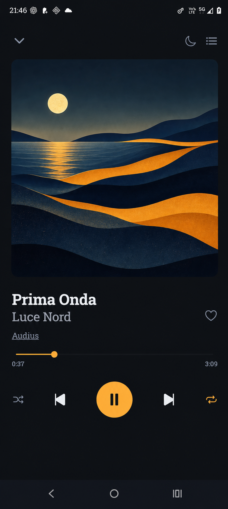
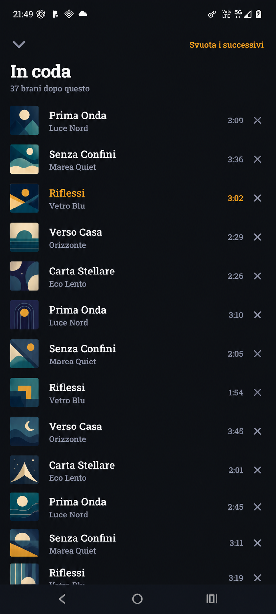

<p align="center">
  
</p>

<h1 align="center">Onda</h1>

<p align="center">
  <strong>La musica indipendente, tutta sulla stessa onda.</strong><br>
  Player Android con codice Onda sotto MIT per ascoltare Audius e Jamendo.
</p>

<p align="center">
  
  
  
</p>

> [!IMPORTANT]
> Questo repository pubblica il sorgente, non un APK ufficiale. Ogni persona
> crea sul proprio computer una copia personale con il proprio Client ID
> Jamendo. L'APK risultante usa una firma personale locale ed è destinato ai dispositivi
> di chi lo compila, non alla ridistribuzione.

## Cosa fa Onda

Onda riunisce [Audius](https://audius.co/) e
[Jamendo](https://www.jamendo.com/) senza account Onda e senza un backend
proprietario. Offre catalogo e ricerca federati, riproduzione in background,
controlli dalla schermata di blocco, coda, preferiti, cronologia, playlist e
timer di spegnimento. La libreria resta sul dispositivo.

## Screenshot

<table>
  <tr>
    <td align="center"></td>
    <td align="center"></td>
    <td align="center"></td>
  </tr>
  <tr>
    <td align="center"><sub><strong>Scopri</strong></sub></td>
    <td align="center"><sub><strong>Player</strong></sub></td>
    <td align="center"><sub><strong>In coda</strong></sub></td>
  </tr>
</table>

<sub>Le schermate usano titoli, artisti e artwork dimostrativi originali; non
rappresentano contenuti reali dei cataloghi.</sub>

## Il modo più semplice: chiedi a Codex o Claude Code

Installa e apri il tuo coding agent, poi incolla questo prompt:

```text
Clona https://github.com/KairosIta/Onda e prepara sul mio computer una build
Android personale seguendo AGENTS.md e docs/BUILD_PERSONAL.md. Controlla prima
l'ambiente con npm run doctor, guidami senza mostrare o committare credenziali,
poi crea e installa l'APK con npm run install:personal. Non pubblicare artefatti,
non cambiare la visibilità del repository e non creare una release GitHub.
```

L'agente può installare software di sistema solo dopo la tua autorizzazione.
Quando richiesto, crea gratuitamente un'app nel
[portale Jamendo](https://devportal.jamendo.com/) e inserisci personalmente il
Client ID in `.env`.

## Installazione manuale

Sono supportati Linux e Windows nativo. WSL2 è possibile, ma richiede JDK e
Android SDK configurati dentro WSL; per la prima installazione su Windows è più
semplice usare PowerShell e Android Studio nativi.

Servono Node.js 22.15 o successivo, JDK 17, Android SDK Platform 36,
Build-Tools 36.0.0 e un dispositivo/emulatore Android. Expo Go non basta.

```bash
git clone https://github.com/KairosIta/Onda.git
cd Onda
npm ci
npm run setup:personal
```

Apri `.env`, sostituisci il valore di esempio con il tuo Client ID Jamendo e
poi esegui:

```bash
npm run doctor
npm run install:personal
```

Senza dispositivo collegato puoi creare soltanto l'APK:

```bash
npm run build:personal
```

Il file sarà in `dist/personal/Onda-personal.apk`. La guida completa, inclusi
PowerShell, debug USB ed errori comuni, è in
[Build personale](docs/BUILD_PERSONAL.md).

## Stato e limiti

- Solo Android; nessun APK o store ufficiale.
- Jamendo richiede un Client ID personale, incorporato nella propria build.
- Gli album sono disponibili solo per i brani Jamendo.
- Nessun ascolto offline.
- Il player nativo `@rntp/player` ha una licenza separata: è gratuito solo per
  uso personale privato o didattico/ricerca accademica qualificata. Ogni altro
  uso richiede una licenza commerciale del fornitore.

La roadmap è in [TODO.md](TODO.md); architettura e collaudi sono descritti
nella [guida per sviluppatori](docs/DEVELOPMENT.md).

## Licenze e responsabilità

Il codice e la documentazione originali di Onda sono disponibili sotto
[MIT](LICENSE). Questa licenza non si estende automaticamente al player RNTP,
agli asset di brand, alle API, alle credenziali, alla musica, agli artwork, ai
metadati o ai marchi di terzi.

Prima di usare, modificare o distribuire il progetto leggi
[Contenuti, software e servizi di terze parti](THIRD_PARTY_CONTENT.md) e la
[nota di conformità](docs/RELEASE_COMPLIANCE.md). Per il trattamento dei dati
consulta l'[informativa privacy](PRIVACY.md).

Contributi e segnalazioni di sicurezza sono descritti in
[CONTRIBUTING.md](CONTRIBUTING.md) e [SECURITY.md](SECURITY.md).
